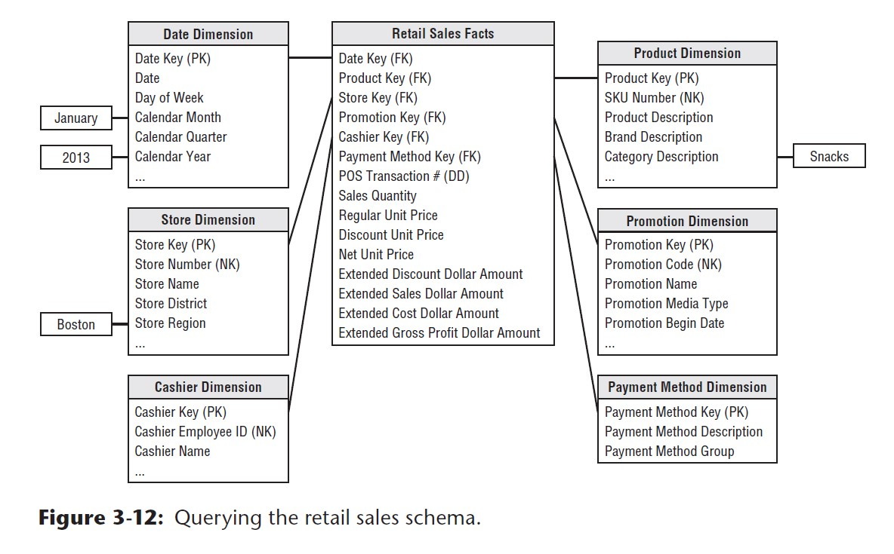
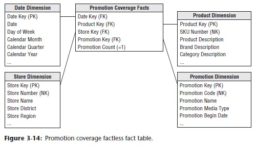
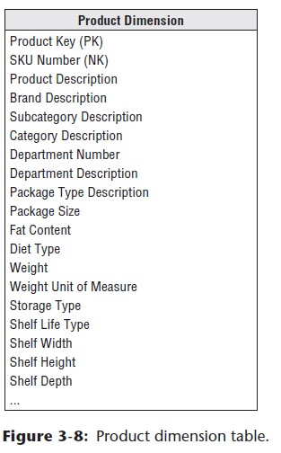
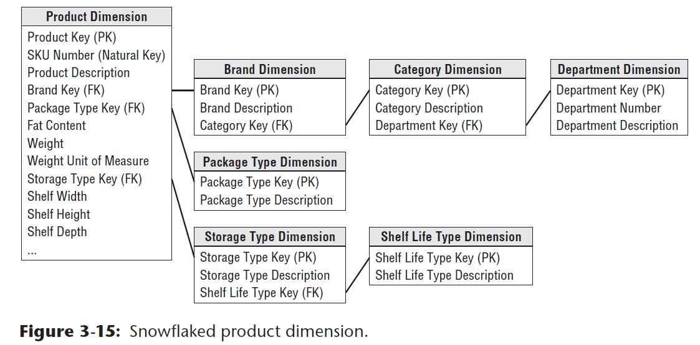
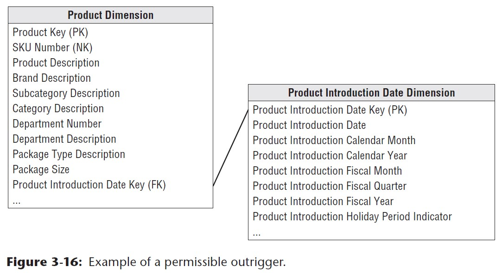
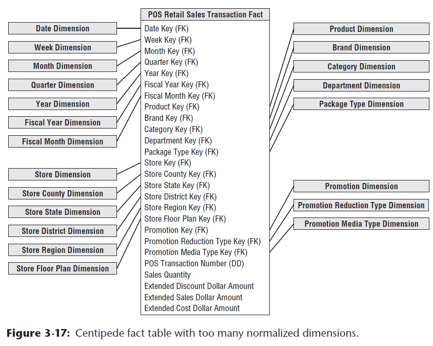

# Chapter 3: Retails Sales Study Notes
This chapter focuses on the build of a typical fact table by introducing the relationship between the built of a fact table to a business process (in this example, it is a retail sales business process). 
The author goes throuh all the decision making process leading towards the design of the following dimensional schema for a retails store:

## Retail Store Business Case

### Business Summary
- large grocery chain with 100 grocery stores in 5 states
- each store sells different types of products (totalling ~6000 SKU on shelves)

#### Data Collection
- cash register: POS system that scan bar codes; customers receive a receipt upon transaction with list of item and total price charged
- back order system for vendor and delivery

#### Business Problem
Management concerned with:
  - ordering logistics
  - stocking
  - profitability
    - pricing
    - promotions

## Four-Step Process for Designing Dimensional Models
1. **Selecting Business Process to model for**
  - business process are activities (can be described using action verbs)
  - numerous operating systems are used to help tracking these business activities
  - KPI and metrics are derived from these captured business process
  - think of business process as a flow system that takes inputs and delivers outputs to the next business process; 
    the series of processes results in a series of fact tables
2. **Declare the model's granularity**
  - at the lowest level, what does a single **fact table** row represent?
    e.g. 1 record in a fact table row represent a credit card transaction
  - **Develop dimensional models representing the most detailed atomic information captured by a business process**
    - **atomic data** is highly dimensional and most flexible
3. **Identify all the dimensions to be captured to the model**
  - how do we describe each record in the fact table?
  - who, what, where, when, why, how...etc of a single record
4. **Identify the facts associated with the chosen business process per step 1**
  - what does the chosen business process measure?
  - fact must be true to the grain

### Retail Store Dimensional Model Design using Four-Step Process
1. POS retail sales transactions chosen as the **business process**;
2. The most **granular data**: an individual product transaction line item on a POS transaction;
3. Date, product, store, promotion, cashier, and payment method are good candidates for fact table dimensions
4. Facts collected by POS:
   - datetime of transaction: **Date Key (FK)**
   - product sold: **Product Key (FK)**
   - store that process the transaction: **Store Key (FK)**
   - promotion given: **Promotion Key (FK)**
   - cashier that processed the transaction: **Cashier Key (FK)**
   - payment method: **Payment method key (FK)**
   - POS transaction unique identifier: **POS Transac. No. (DD)**
   - sales quantity: **numeric measure**
   - per unit price: **numeric measure**
   - discount: **numeric measure**
   - net paid prices: **numeric measure**
   - extended cost dollar amounts: **numeric measure**

## Additive, non-additive, and derived facts
### Additive Facts
Fact measures from each row record that can be added across the table to provide summary measures. (can be aggregated using SUM() to provide high-level total amounts.)
  - sales quantity
  - extended discount
  - sales
  - cost dollar amounts
  are additive facts for the retails store case

### Derived Facts
A fact derived from performing calculations based on existing fact. e.g. calculating gross profit that's derived from the existing extended cost dollar amounts and sale price.

#### Should you store a calculated derived fact in the database?
- generally recommended to be stored physically for **consistency**

#### Advantage
- means computed consistently in the ETL process
- eliminates the possibility of user calculation errors
- ensures all users and BI reporting applications refer to the derived fact consistently

#### Disadvantage
- potential storage cost and processing pressure

### Non-additive Facts
Fact measures from each row that cannot be added or summarized along any dimension.
- gross margin is calculated by **division**: gross profit / sales revenue
- unit price is price per unit cannot be summed across any dimensions
Percentages and ratios are always non-additive. The numerator and denominator should be stored in the fact table. The ratio can then be calculated in BI tool for any slice of the fact table. Notice they should be calculated as **ratio of the sums** not the sum of ratios.

### Transaction Fact Tables
- the most common type of fact table
- characteristics:
  1. atomic grain: 1 row per transaction line
  2. they tend to be highly dimensional
  3. metrics resulted from the events are typically additive as long as they have been **extended** by quantity amount rather than per unit metrics
### Estimate Number of Rows
- very important to evaluate at early stage of design
- estimate number of new rows added per year: annual gross revenue / average item selling price

## Dimension attributes: indicators, numeric descriptions, and multiple hierarchies

### Date Dimension
- dimensional models always need an explicit date dimension table
- every business process captures a time series of performance metrics
- date dimension can be built in advance with each row representing a particular day
  - 20 years worth of date dimensions ~ 7300 rows
- a date dimension is needed b.c it allows for flexible filtering to be applied on the data
  - SQL functions do not allow filtering by weekdays, weekends, holidays, fiscal periods etc.
#### Set Meaningful and Self-explanatory Flags and Indicators
-  date dimension's holiday indicator has 2 potential values (boolean)
-  always think about what **values** would the flag/indicator serve
   - need to give **meaningful values** even though it is a boolean
   - `Y/N` vs. `Holiday/ Non-Holiday`
   - meaning ful domain translate indicator into a more self-explanatory report
   - you do not have to spend time decode the meaning of the boolean/ flag values
#### Relative Date Attributes
- most of dimension attributes are not subject to **frequent updates**
- some will change over time relative to the passage of time
  - is_current_day / is_current_month
  - is_prior_60_days
  - unique corporate financial reporting calender e.g. is_fiscal_month_end
- some date dimensions should include updated **lag attributes**
  - 0: today; +1: tomorrow; -1: yesterday
  - recommends **computed column** rather than physically stored
  - if BI tools automatically performas this calculation, then no need to add lag columns

#### Time-of-day should be captured as a Fact using timestamps
- time-of-day typically separated from date dimension to avoid row count explosion in date dimension
- date dimension should be kept small and manageable
- think of granularity: 
  - date granular: 7000 rows for each day in 20 years
  - *1440 mins per day if granularity at minutes
- time-of-day should be handled as a simple date/time fact in the fact table

## Product Dimension

- describes every SKU in grocery store
- sourced from operational product master file

### Flatten Many-to-one Hierarchies
Typical merchandise hierarchy contains:
- individual SKUs >> brands >> categories >> departments
- each of the roll-up is a **many-to-one** relationship 
- no need to seoarate repeated values into a second normalized table to save space (b.c vs fct tables, they are relatively small)
- **keep the repeated low cardinality values in primary dimension is a fundamental modeling technique**
- some attribute do not necessarily form any hierarchy e.g. `packaging_type`, b.c. any row can have one of these values

### Attributes with Embedded Meaning
Natural key identifiers (e.g. SKUs) can contain different parts in the code, with each part carrying different meaning. These multi parts in the natural key identifiers should be:
- have the entire code be preserved as a unique identifier
- the parts broken down into component parts representing different attributes

### Numeric values as Attributes or Facts

1. Dimension tables should be consistent
2. Data involved in calculations should be in fact tables
3. Data involved in constraints, groups, and labels should be in dimension tables

- Would the numeric value be used primarily for calculation purpose? Yes: fact table; No: dim table
- Would the numeric value used more for grouping or filtering? Yes: dimtable; No: fact table

Sometimes, numerci values can serve calculation and filtering purpose.
- store value in both fact and dimension tables

Date Elements are used both for fact calculations and dimension constrainin and should be stored in both locations.

### Drilling Down on Dimension Attributes
More dimenions adds more capabilities for users to group and filter their analysis and hierarchies.

## Store Dimension
Describes every store in grocery chain. Notice that, compared to product dimensions, each store may have different source file.

### Multiple Hierarchies in Dimension Tables
- very common to have multiple hierarchu in a dimension table
- the atrtribute names and values should be unique across the multiple hierarchies (thus each row is unique)

### Recommended Retail Store Dimension
Store Key (PK) | Store Number (FK) | Store Name |Store Street Address| Store City | Store County | Store City-State | Store State | Zip Code | Store Manager | Store Distinct | Store Region | Floor Plan Type | First Open Date | Total Square Footage

### Dates Within Dimension Tables
- `first_open_date` and `last_remodel_date` in store dimension should be **date type**
- join keys to date dimension table if users want to group by different calendar attributes

## Promotion Dimension
- often called a **casual dimension**: it describes the factors thought to cause a change in product sales

### Available Sources
- POS systems: do not directly track casual conditions affectinga sales
- Transaction systems: price reduction and markdowns
- Coupons: captured with transactions
- Ads and in-store display

Various possible casual conditions are highly correlated:
e.g. where products are displayed for buyers' convenience

- create one row in promotion dimension for each combination of promotion conditions that occurs

### How to record promotions: a trade-off to make
1. separating casual mechanisms into seperate dimensions
   - more understandable to business
   - administration will be more straight forward 
2. keeping the dimensions together
   - if the attributes are highly correlated, combined dimension is not much larger than any one of the separated dimensions
   - combined single dimension can be browsed effectively; but only shows what are the combinations are available
### Promotion Cost
- this attribute can be used for constraining and grouping
- should not appear in POS transaction fact table b.c it is at the wrong grain
- this cost should reside in a fact table whose grain is the overall promotion
- promotion dimension must include a row, with a unique key to indentify this no promotion condition and avoid null promotion ket in the fact table

### Null Foreign Keys, and Facts
Referential integrity is violated if you put a null in a fact table column declared as a foreign key to a dimension table
**Must avoid null keys in a fact table. A proper deisgn includes a row in the corresponding dimension table to identify that dimension is not applicable to the measurement.**
- Recommending using `Not Applicable` or `Unkown` to replace null value because this way we at least assign the condition to the nulls so that users can decide which nulls they should include or exclude from reporting
- for fact table, be careful with substituting nulls by 0, which will skew the aggregated calculations

### Sample Promotion Table
Promption Key (PK) | Promotion Code | Promotion Name | Price Reduction Type | Promotion media Type | Ad Type | Display Type | Promotion Cost | Promoition Begin Date | Promotion End Date

## Other Retail Sales Dimensions
- any descriptive attribute that takes on a single value in the presence of a fact table measurement should be considered added to an existing dimension or be its own dimension
- whether a dimension should be associated with a fact table should be a binary yes/no based on **fact table's decalred grain**

### Payment Method Fact Table Sample
How do we arrange the fact table for a POS system that allows multiple payment methods per transaction?
- one row per payment method per product?
- Capture payment method in a separate fact table
  - one row per transaction
  - one row per payment method per transaction 

## Degenerate Dimensions for Transaction Numbers
POS transaction number is a **degenerate dimension (DD)**, which sits by itself in the fact table without joining to a dimension table.
Very common when grain of a fact table represents a single transaction or transaction line b.c. DD represents the unique identifier of the parent.
Examples are:
  - order numbers
  - invoice numbers
  - natural operational ticket number

In this retail sales case, POS transaction number is a DD. Under each transaction id there can be multiple line items.

## Retail Schema in Action
See Figure 3-12 in the book:

## Extensibility of Dimensional Models: all about granularity symmetry of existing model and the extended model
Business change over time and new process will be introduced. When new process gets introduced the dimensional model will be extended to accomondate the new process.
e.g. Introducing a frequent shopper program to allow analyzing each shopper's preference and behaviour
#### Issues to Remember
- the extension will be prospective
  - introducing a **surrogate key** on historical fact table rows: `prior_to_frequent_shopper_program`
  - introducing a `frequent_shopper_not_identified` row in shopper dimension (to deal with nulls)
 - at the beginning of schema design a great granularity definition will help future extsnion of dimensional model to be smooth
 - **Predictable symmertry**: premature summarization or aggregation limit our ability to add supplemental dimensions if the grains do not match
 - extending an existing model always involves the following:
   - **New dimension attributes**: new column added (still remeber to deal with nulls by adding `Not Applicable`)
   - **New dimensions**: adding a dimension to an existing fact table by adding new FK
   - **New measured facts**: need more attention when new measure is at different grain: new measure will have to be put in their own fact table
 
## Factless fact tables - What did not happen?
Sometimes the business need to use what did not happen to understand event coverage. A **factless fact table** would be helpful in this case.
E.g. a promotion coverage fact table regardless whether the product gets sold
  - one row for each production on promotion in a store each promotion period
  - enables us to see relationship between keys as defined by a promotion, **independent of other events**
  - has no measure metrics
  - only captures the relationship between involved keys

 

## Dimension and Fact Table Keys

### Dimension Table Surrogate Keys
[Surrogate key](https://en.wikipedia.org/wiki/Surrogate_key) should be used as the unique primary key in a dimension table rather than a natural key - operational system identifier. Primary key (PK) and foreign key (FK) are both surrogate keys. They are clean integers assigned by the ETL system.
**Avoid using natural keys as dimension table's primary key.**
- natural keys may be fast at the beginning but in the long term required little maintainance and rework because
  1. Surrogate keys buffer data warehouse from operational changes
  2. Integrate multiple source system: keeping the natural keys from different operational systems while still haveing the surrogate key is very helpful in the link
  4. Improve performance: surrogate keys are actually very small in storage
  5. Handle null or unknown conditions
  6. Support dimension attribute change tracking
 
 ### Dimension Natural and Durable Supernatural Keys
 Natural keys are often modeled as an attribute in a dimension table, it is recommended we specify the natural key's source. 
 Also important to have an identifier that tracks the dimensiooon entity across its attribute changes other than solely relying on a natural key.
   - use of supernatural key: a type of permanent durable surrogate key that remains immutable for the life of a system. It is not a replacement for a dimension table's surrogate primary key
 
 ### Degenerate Dimension Surrogate Keys
 A `surrogate key` is necessary if the transaction control numbers are not unique across locations or get reused.
 
 ### Date Dimension Smart Keys
 How to determine the primary key of a date dimension?
 Calendar dates are fixed and predetermined, so it is predictable and follows a pattern. Using `yyyymmdd` as the date's primary key, or sometimes just a date-type column like `yyyy-mm-dd`.
 Filtering and grouping on calendar attributes should occur in a dimension table, not inthe BI application's code.
 Date smart keys are useful for partitioning fact tables.
 
 ### Fact Table Surrogate Keys
 - Kimball does not really restrict fact table to have surrogate keys b.c. surrogate keys only make sense for back room ETL processing
 
 **Benefits**
 1. immediate unique identification
 2. backing out or resuming a bulk load
 3. replacing updates with insets plus deletes
   - fact tables w/o primary key can only be determined unique by specific combination of dimensional foreign keys
   - with fact table surrogate keys, easy to target what to update and remove
 4. using the fact table surrogate key as a parent/child schema
   - surrogate key in a parent fact table is also available in a child fact table
   - but such presense is not for joining fact tables, we should never join fact tables directly to other fact tables
   - this is only used for allowing the child fact tables to be sliced and diced without travering the parent fact table's surrogate key
 
## Resisting Normalization Urges
 
### Snowflake Schema with Normalized Dimensions
- flattened and denormalized dimension tables have so many repeating textual values
  e.g. denormalized model would store 300,000 products from 50 departments with each product row having the same deparment description columns
  - instead, normalized model saves departmental details in a separate dimension table, leaving the product table with a FK to the department table
    - easier to maintain and update: deptament information update no longer need to be scraped over all product rows, but only one place of change in the department dimension table
- **Dimension table normalization is `snowflaking`**
  - reducing redundant attributes from teh flat and denormalized dimension table by placing them into seperate normalized dimension tables
- Figure 3-8 shows that a comprehensive fact table can become a denomalized table:

  
  
- Figure 3-15 shows that a comprehensive product dim table can be normalized into multiple dimension table:

  

- **Kimball encourages modelers not to snowflake dimensional tables due to the following factors:**
  1. complicated structure to busienss users
  2. require more joins, which will yield slower query performance
  3. eat up minor disk space savings
  4. negatively impacts user's ability to do cross-attribute browsing because connections are spread over different dimension tables
  5. interferes with ability to leverage bitmap indexing
- fixed depth hierarchies should be flattened in dimension tables

### Outtrigger Dimension
`Outtrigger dimension` is built to be attached to a dimension.

  
  
  - outtriggered dimension tables should only be used when business has specific filtering or grouping needs on an existing dimension
  - remember they again introduce more joins and can interfere querying performance

### Centipede Fact Tables with Too Many Dimensions

- Fact tables in a dimensional schema is naturally highly normalized and compact
- `Centipede fact tables` occur when:
  - while knowing snowflaking in discouraged, modelers go around with joining normalized tables to the fact tables, resulting in a fact tables joining to multiple normalized dimension tables
  - worth mentioning that snowflaking is dimension branched off to many other dimensions
   
  
  
  vs. dimension snow flasking in Figure 3-15
  
  

- centipede fact tables increase disk space requirements (b.c. fact tables are usually the largest tables)

#### How large should a fact table be?

- most business process can be represented with <= 20 dimensions in the fact table
- if dimension > 25, indicates ways to combine correlated dimensions into a single dimension
- always put perfectly correlated attributes and attributes with reasonable statistical correlation in the same dimension
- encourage to combine small dimensions into one new single dimension
- never represent elemnts of a single hierarchy as separate dimensions in the fact table

## Centipede fact tables with "too many dimensions"
