# Chapter 4: Inventory

## Value Chain
**Value chain** - natural, logical flow of an organization's primary activities. How do the company deliver value to customers?
- operational source systems produce transactions/snapshot at each step of the value chain
- within each step, performance metrics can be tracked
- each process spawns one or more fact tables
- the value chain can usually provide high-level insight into the overall data architecture for an enterprise DW/BI environment

## Inventory Models

3 Models are discussed around inventory:

1. periodic snapshot model
2. inventory transaction model
3. inventory accumulating snapshot

### 1st Model: Inventory Periodic Snapshot

#### Business Context

- what is the optimized inventory level?
- what is the daily inventory level by product and store?

#### 4 step dimensional design
1. Business process: periodic snapshot of retail store inventory
2. Granularity: daily inventory for each product in each store
3. Dimensions: date, product, and store

Below is a simple dimensional design to start with:

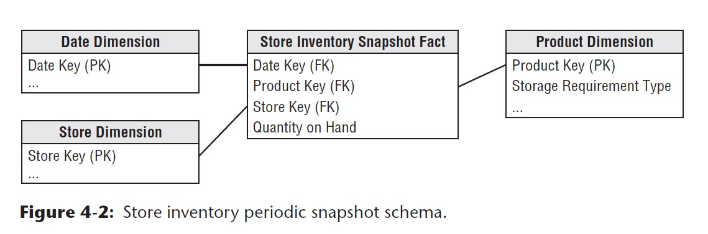

Note the following:
- the `Date Dimension` that's been created before is reused in this model
- the `Product Dimension` and `Store Dimension` also exist, but has been **enriched** with more attributes (columns) when the inventory model is built

#### Challenges of Inventory Modeling vs. Sales Modeling

- inventory is a dense process so it will create dense snapshot table(s)
- there may be a row in the fact table for every product in every store every day (approx. 6M rows would be inserted each load per night)

#### Semi-additive Facts

Some of the measures in the inventory snapshot model cannot be added, because they represent the balance of the day (`inventory levels`) rather than other flow measures. These measures are additive across some dimensions but not all. At analytical level, the best way to summarize (aggregate them) is to use **AVG rather than SUM**. 

**Note**: All measures that record a `static level` are inherently non-additive across date dimension and possibly other dimensions. These measures may be aggregated across dates by averaging over the number of time periods.

#### Enhanced Inventory Facts: enriched metrics
Business process and need for analytics are usually complicated, so apart from simply providing a snapshot of inventory level is not enough. 

A timeseries analysis usually involves connecting to other additional facts to develope other interesting calculated metrics. For example:
  - inventory movement velocity
  - number of turns: quantity sold / quantity on hand
  - number of days' supply: final quantity on hand / avg. quantity sold
  - extended value of inventory at cost
  - value at the latest selling price

Below is how this inventory model can be further enriched with considerations above:

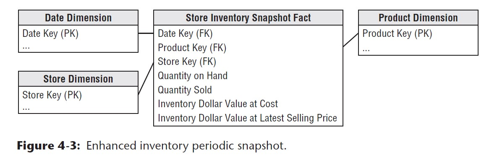

### 2nd Model: Inventory Transactions

- involves **recoding every transaction that affects inventory**
  - these are the incremental ups and downs that will affect the quantity (balance) on hand
- example transactions can happen at these **activity flows**: any time a product **flows from one point to another** triggers opportunity to measure **transaction**
  - receiving product
  - removing product from inventory
  - return defected product to vendor
- granularity: 1 row per inventory transaction with `dates`, `product_name`, and `quantity` etc.

#### Why capturing inventory transactions?

- useful for inventory flow performance analysis
- do not rely solely on inventory transactions on performance
- need to combine analysis with transactions and snapshots for well-rounded understanding

#### Real-life Implication

- it would be easy if all types of inventory transactions all share the same dimensionality
- in real life, not all transactions have the same dimensions due to the nature of the flow
- if all transactions share consistent dimensions, it is okay to capture all transactions in the same fact table
- if not all share consistent dimensions, **better to create a series of fact tables**

### 3rd Model: Inventory Accumulating Snapshot Fact Tables

- use for process with **definite beginning, definite end, and identifiable milestone in between**
- a new row is added in the fact table when a particular product is received at the warehouse
  - the disposition will also be tracked on this fact row until it leaves the warehouse
- think of this as a collection of dates for each product each row

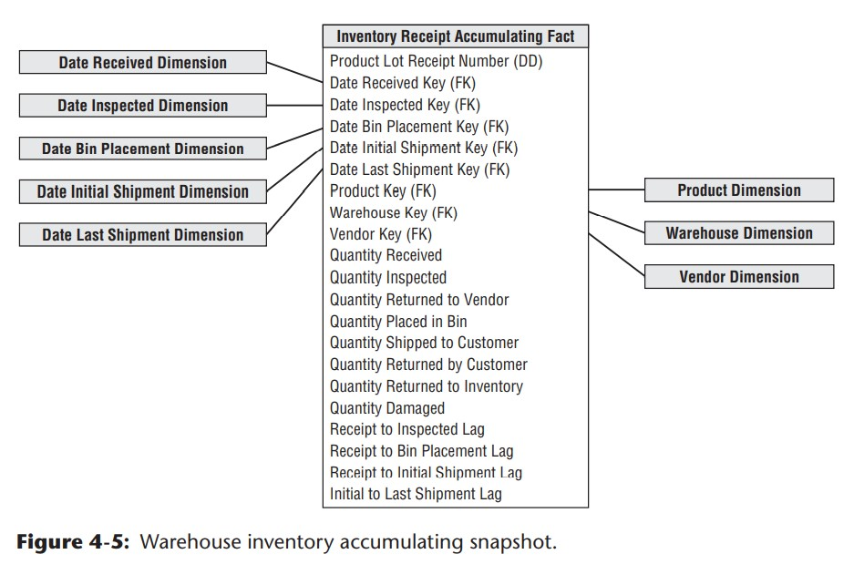

- each row will represent 1 unique product's flow, and it will evolve as the status of the product gets updated

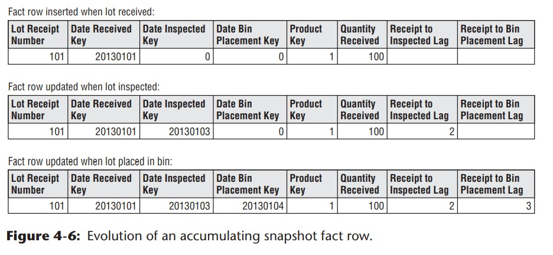

## Fact Table Types

The following types hold true across all industries:

1. transaction fact table
2. period snapshot fact table
3. accumulating snapshot fact table

- you often need **two complementary fact tables to get a complete picture of the business**

Here is a comparison of each fact table type:

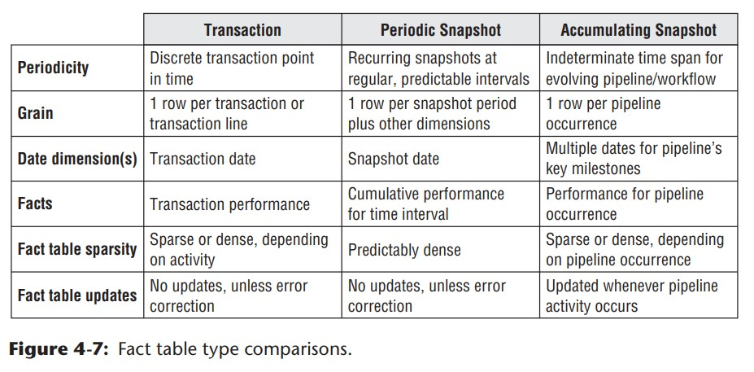

### Transaction Fact Tables

- provides the most fundamental view of the business' operation
- each row represents a event that occurred at a point in time
- benefit: fits well into dimensional framework due to its atomic level
- allows us to analyze into extreme detail
- need to be paired up with other fact tables to get better practical use

### Periodic Snapshot Fact Tables

- provides cumulative performance of business at **predictable intervals**
- usually has fewer dimensions vs. transaction fact tables

### Accumulating Snapshot Fact Tables

- not commonly used
- used when business wants to perform **workflow or pipeline analysis**
- multiple date foreign keys: represents major events or process milestones

#### Lags between Milestones and Milestone Counts

- accumulating snapshot fact tables always contains metrics representing the durations or lags between key milestones
  - duration = difference between milestone date/timestamps

#### Accumulating Snapshots Updates and OLAP Cubes

- accumulating snapshot fact tables will be updated and previous value may not be preserved
- reflects the most current status and metrics
- do not use accumulating snapshots for scenarios that occur infrequently > use transaction fact tables instead
- typically problematic for OLAP cubes
  - updating rows in the table would force both facts and dimension foreign keys to change > the cube will need to be reprocessed

### Complementary Fact Table Types

- accumulating + periodic snapshots complement each other when:
  - incrementally build monthly snapshot by adding the effect of each day's transactions to a rolling accumulating snapshot while also storing historical data in a periodic snapshot
- transactions + periodic snapshot complement each other in dimensional designs
  - provides complete view of the business

## Value Chain Integration

integration means how we are linking data from each process together so that business is able to see the whole picture through data models.
- each model from each process sometimes share the same **business dimensions**

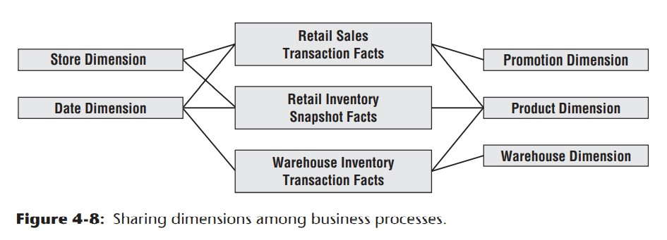

## Enterprise Data Warehouse Bus Architecture

Rome is not built in one day, better use incremental approach to build the warehouse.

### Bus Architecture

Bus - things that can be connected to other objects

- bus interface for DW/BI environment allows incremental dimension tables to be built at different times (without disrupting what's been built)

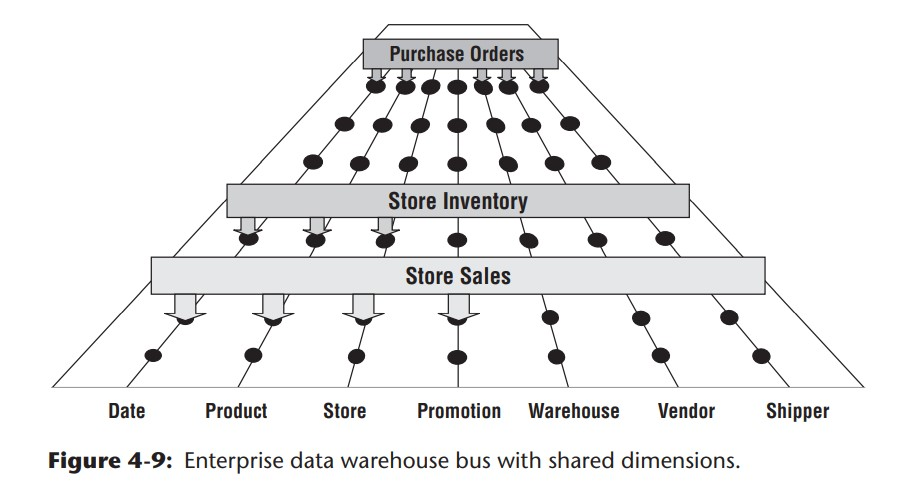

### Enterprise Data Warehouse Bus Matrix

- use it to document and communicate the bus architecture

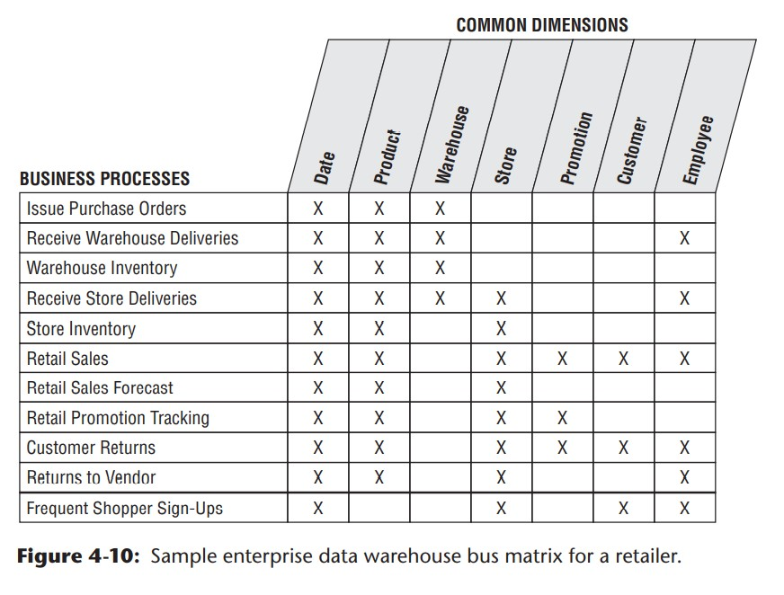

- rows: organization business process
  - only grab the primary activities
  - usually has a operational data source
  - start with one business process row
  - you will often identify more consolidated processes when an individual process is done

- columns: common dimensions used across the enterprise
  - start with creating a list of **core dimensions** before filling the matrix
  - the size of the matrix vary by organizations

#### Multiple Matrix Uses

The matrix is the beginning of architecture planning, database design, data governance, project planning, and organizational communication.

#### opportunity/Stakeholder Matrix

Different matrix that leverage the **same business process** can be drafted for different departments.

#### Common Bus Matrix Mistakes to Avoid

1. Avoid using the rows to represent departments
2. Matrix should not resemble a laundry list of requested reports
3. Do not lump or group similar dimensions into one generic dimension. Make the dimensions separate
4. Do not separate for each level of a hierarchy
  - the columns of  the bus matrix should refer to dimensions at their most granular level
  - can denote the granularity within the matrix cell

#### Retrofitting Existing Models to a Bus Matrix

What happens if you are not starting with a blank slate?
- several dimensional models have been constructed without architecture regards
- start with determining the gaps between current model vs. organizations' architecture goal
- map existing dimensional mode to a standardized and sound design

## Conformed Dimensions

`conformed dimensions`: common dimensions that are shared across business fact tables

- should be built only once in the DW/BI environment
- once built all teams should use them (set as a policy)

### Drilling Across Fact Tables

- allows users to JOIN performance measures from different business process into a single report
- for example, can be joined in SQL using `FULL OUTER JOIN`

### Identical Conformed Dimensions

Identical conformed dimensions have consistent dimensional keys. attribute column names, attribute definitions, adn attribute values

- most conformed dimensions are defined naturally at the most granular level

### Shrunken Rollup Conformed Dimension with Attribute Subset

- dimensions also conform when that contain a subset of attributes from a more granular dimension
- they are required when a fact table captures performance metrics at a higher level of granularity than the atomic base dimension
- they conform to the base atomic dimensions if the attributes are a strict subset of the atomic dimension's attributes

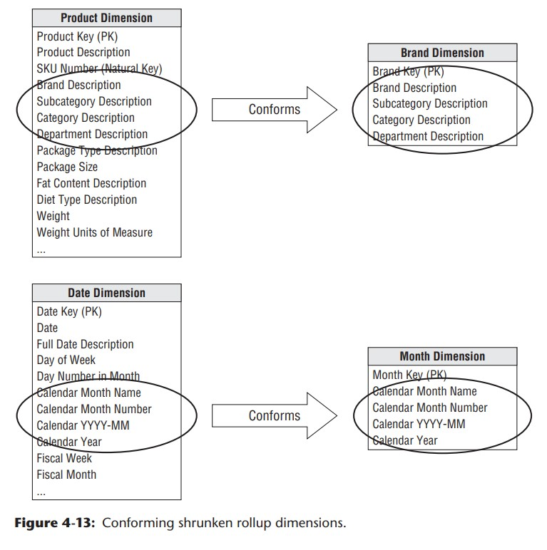

### Shrunken Conformed Dimension with Row Subset

- when two dimensions are at the same level of detail but one represents on a subset of rows
- be careful with dimension subset, because when using shrunken subset dimension to access a fact table with a complete product set, the joined result may not be complete

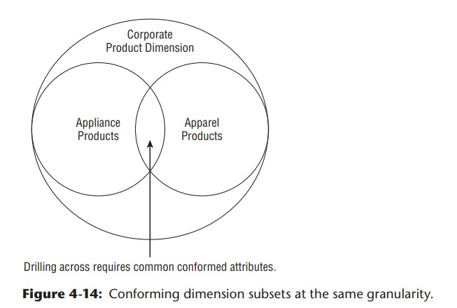

### Shrunken Conformed Dimensions on Bus Matrix

- a bus matrix can also identify the use of common dimensions across business process

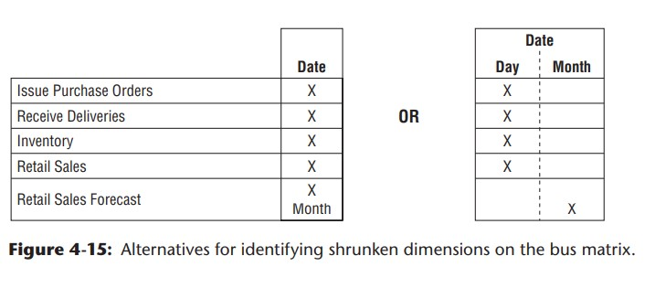

### Limited Conformity

When not to build conformed dimensions?

- when business process, lines, has unique entries, categories, and customers (just so different)
- when there is really no connection among the business processes: subsidiary
- better to build separate and self-contained data warehouses for each subsidiary
- still work on building some degrees of integration

### Governance

data governance: critical so that each department understands what their data can help with in a larger (joined) scope

#### Objectives

- to reach agreement on data definitions, labels, and domain values
- establish policies and responsibilities for data quality and accuracy; data security and access controls

### Conformed Dimensions and the Agile Movement

How to stand up for conformed dimension by challenging that conformed dimensions enable DW/BI development along with **agile decision making**.

## Conformed Facts

- think about what are the KPIs that should conform in the fact tables
  - revenue
  - profit
  - costs
  - customer score etc..

- if facts live in more than one dimensional model, the underlying definitions and equations for these facts must be the same

- must be disciplined in data naming practices

- sometimes a fact has a natural unit of measure in one fact tables and another in a different one
  - e.g. measure unit in different locations (1 unit = 1 case; 1 unit = 1 box)
- solution: build a conversion factor among different process so that it can unite the measures
- also carry the fact in both units of measure

