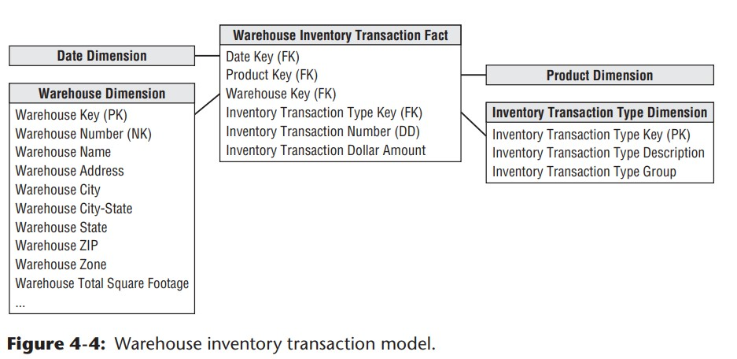

# Chapter 4: Inventory

## Value Chain
**Value chain** - natural, logical flow of an organization's primary activities. How do the company deliver value to customers?
- operational source systems produce transactions/snapshot at each step of the value chain
- within each step, performance metrics can be tracked
- each process spawns one or more fact tables
- the value chain can usually provide high-level insight into the overall data architecture for an enterprise DW/BI environment

## Inventory Models

3 Models are discussed around inventory:

1. periodic snapshot model
2. inventory transaction model
3. inventory accumulating snapshot

### 1st Model: Inventory Periodic Snapshot

#### Business Context

- what is the optimized inventory level?
- what is the daily inventory level by product and store?

#### 4 step dimensional design
1. Business process: periodic snapshot of retail store inventory
2. Granularity: daily inventory for each product in each store
3. Dimensions: date, product, and store

Below is a simple dimensional design to start with:

Note the following:
- the `Date Dimension` that's been created before is reused in this model
- the `Product Dimension` and `Store Dimension` also exist, but has been **enriched** with more attributes (columns) when the inventory model is built

#### Challenges of Inventory Modeling vs. Sales Modeling

- inventory is a dense process so it will create dense snapshot table(s)
- there may be a row in the fact table for every product in every store every day (approx. 6M rows would be inserted each load per night)

#### Semi-additive Facts

Some of the measures in the inventory snapshot model cannot be added, because they represent the balance of the day (`inventory levels`) rather than other flow measures. These measures are additive across some dimensions but not all. At analytical level, the best way to summarize (aggregate them) is to use **AVG rather than SUM**. 

**Note**: All measures that record a `static level` are inherently non-additive across date dimension and possibly other dimensions. These measures may be aggregated across dates by averaging over the number of time periods.

#### Enhanced Inventory Facts: enriched metrics
Business process and need for analytics are usually complicated, so apart from simply providing a snapshot of inventory level is not enough. 

A timeseries analysis usually involves connecting to other additional facts to develope other interesting calculated metrics. For example:
  - inventory movement velocity
  - number of turns: quantity sold / quantity on hand
  - number of days' supply: final quantity on hand / avg. quantity sold
  - extended value of inventory at cost
  - value at the latest selling price

Below is how this inventory model can be further enriched with considerations above:

### 2nd Model: Inventory Transactions

- involves **recoding every transaction that affects inventory**
  - these are the incremental ups and downs that will affect the quantity (balance) on hand
- example transactions can happen at these **activity flows**: any time a product **flows from one point to another** triggers opportunity to measure **transaction**
  - receiving product
  - removing product from inventory
  - return defected product to vendor
- granularity: 1 row per inventory transaction with `dates`, `product_name`, and `quantity` etc.

#### Why capturing inventory transactions?

- useful for inventory flow performance analysis
- do not rely solely on inventory transactions on performance
- need to combine analysis with transactions and snapshots for well-rounded understanding

#### Real-life Implication

- it would be easy if all types of inventory transactions all share the same dimensionality
- in real life, not all transactions have the same dimensions due to the nature of the flow
- if all transactions share consistent dimensions, it is okay to capture all transactions in the same fact table
- if not all share consistent dimensions, **better to create a series of fact tables**

### 3rd Model: Inventory Accumulating Snapshot Fact Tables

- use for process with **definite beginning, definite end, and identifiable milestone in between**
- a new row is added in the fact table when a particular product is received at the warehouse
  - the disposition will also be tracked on this fact row until it leaves the warehouse
- think of this as a collection of dates for each product each row

- each row will represent 1 unique product's flow, and it will evolve as the status of the product gets updated

## Fact Table Types

The following types hold true across all industries:

1. transaction fact table
2. period snapshot fact table
3. accumulating snapshot fact table

- you often need **two complementary fact tables to get a complete picture of the business**

Here is a comparison of each fact table type:

### Transaction Fact Tables

- provides the most fundamental view of the business' operation
- each row represents a event that occurred at a point in time
- benefit: fits well into dimensional framework due to its atomic level
- allows us to analyze into extreme detail
- need to be paired up with other fact tables to get better practical use

### Periodic Snapshot Fact Tables
