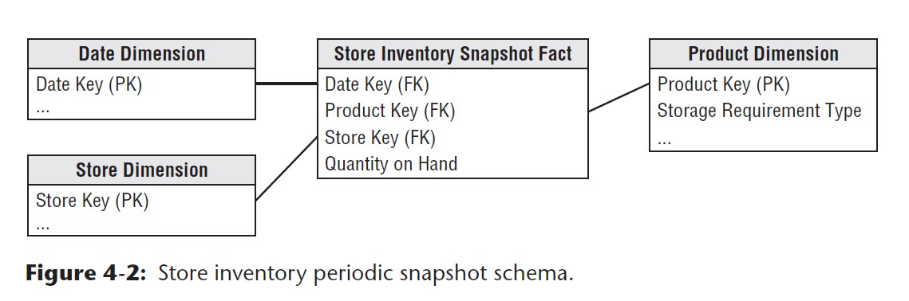
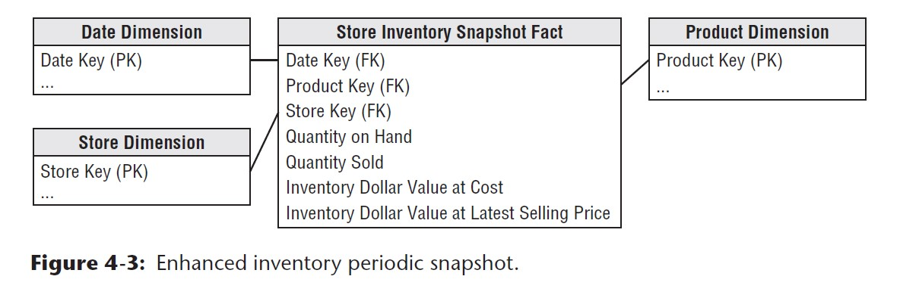

# Chapter 4: Inventory

## Value Chain
**Value chain** - natural, logical flow of an organization's primary activities. How do the company deliver value to customers?
- operational source systems produce transactions/snapshot at each step of the value chain
- within each step, performance metrics can be tracked
- each process spawns one or more fact tables
- the value chain can usually provide high-levl insight into the overall data architecture for an enterprise DW/BI environment

## Inventory Models

3 Models are discussed around inventory:

1. periodic snapshot model
2. inventory transaction model
3. inventory accumulating snapshot

### 1st Model: Inventory Periodic Snapshot

#### Business Context

- what is the optimized inventory level?
- what is the daily inventory level by product and store?

#### 4 step dimensional design
1. Business process: periodic snapshotting of retail store inventory
2. Granularity: daily inventory for each product in each store
3. Dimensions: date, product, and store

Below is a simple dimensional design to start with:

Note the following:
- the `Date Dimension` that's been created before is reused in this model
- the `Product Dimension` and `Store Dimension` also exist, but has been **enriched** with more attributes (columns) when the inventory model is built

#### Challenges of Inventory Modeling vs. Sales Modeling

- inventory is a dense process so it will create dense snapshot table(s)
- there may be a row in the fact table for every product in every store every day (approx. 6M rows would be inserted each load per night)

#### Semi-additive Facts

Some of the measures snapshotted in the inventory snapshot model cannot be added, because they represent the balance of the day (`inventory levels`) rather than other flow measures. These measures are additive across some dimensions but not all. At analytical level, the best way to summarize (aggregate them) is to use AVG rather than SUM. 

**Note**: All measures that record a `static level` are inherently non-additive across date dimension and possibly other dimensions. These measures may be aggregated across dates by averaging over the number of time periods.

#### Enhanced Inventory Facts
Business process and need for analytics are usually complicated, so apart from simply providing a snapshot of inventory level is not enough. 

A timeseries analysis usually involves connecting to other additional facts to develope other interesting calculated metrics. For example:
  - inventory movement velocity
  - number of turns: quantity sold / quantity on hand
  - number of days' supply: final quantity on hand / avg. quantity sold
  - extended value of inventory at cost
  - value at the latest selling price

Below is how this inventory model can be further enriched with considerations above:

### 2nd Model: Inventory Transactions

