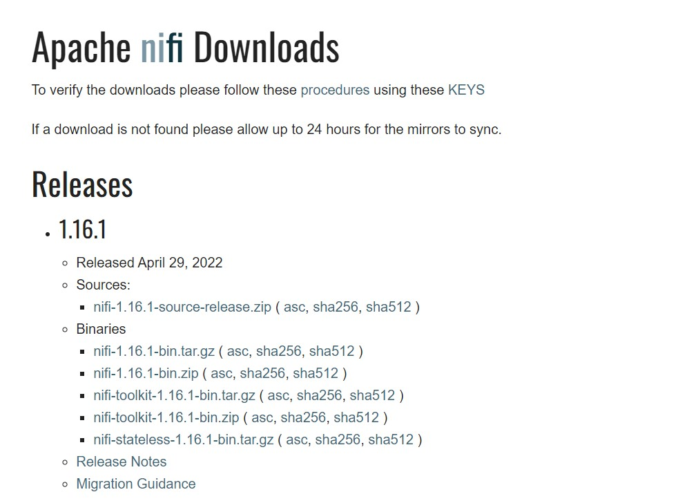
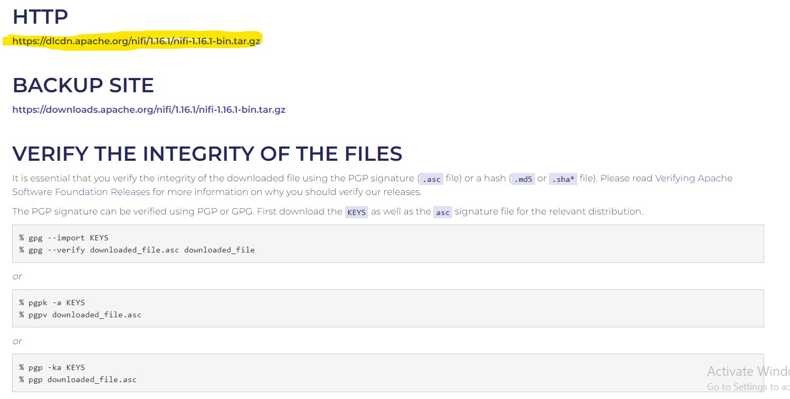
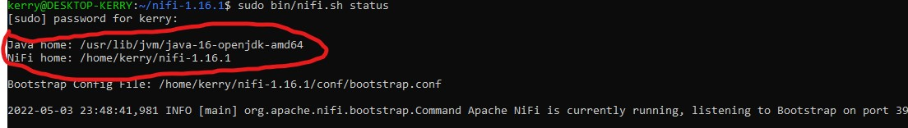
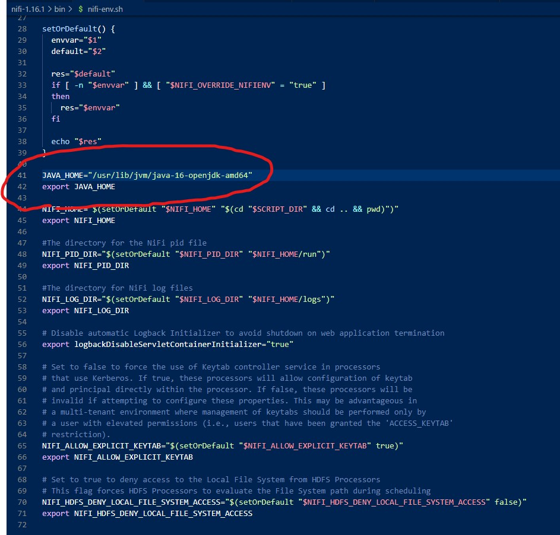

# NIFI Installation Guide
Modification date: 2022-05-03

After going through the pain to install and set up the Nifi and acknowledging the book's information is way out-dated. I decide to share my installation steps to help readers smoothing out this painful process.

Note: I installed Nifi (the newest version) using my Ubuntu terminal on Windows machine

## Installing Apache Nifi using Ubuntu
The steps the book provides for installation is somewhat valid, and my notes here just add some extra clarity in addition to the book.

I used this youtube video as my reference, but I did not follow this [video](https://youtu.be/H-leB4XceCM) completely because the person is using aws to connect to Nifi, but it provides helpful commands to help me download and extract the nifi package.

1. Go to Nifi's [download site here](https://nifi.apache.org/download.html)
2. Find the newest releases. For me, it was version 1.16.1

3. If you are downloading the Nifi through Ubuntu, you **MUST** click on the `nifi-1.16.1-bin.tar.gz` under the `Binaries` section

4. When you click into the [nifi-1.16.1-bin.tar.gz](https://www.apache.org/dyn/closer.lua?path=/nifi/1.16.1/nifi-1.16.1-bin.tar.gz) you will see the `http` link available for you to execute the `wget` command

  

  So in this case, you will need to execute

  `wget https://dlcdn.apache.org/nifi/1.16.1/nifi-1.16.1-bin.tar.gz`

5. After completion, you are not done yet, because you just downloaded the installation package to your console, now you need to extract the file by running:

  `tar -xvf nifi-1.16.1-bin.tar.gz` 

  Note: depending on the newest version your download, the `nifi-<version>-bin.tar.gz` will vary

6. After the extract have completed you need to `cd` into the nifi by running:

  `cd nifi-1.16.1`

7. Do an `ls` you will see there is a `bin` folder inside the `nifi-1.16.1` folder, but you do not yet need to `cd` into the `bin` folder

8. **Now it is time to check your Java version** by running `java --version`; if you do not have java installed, according to this [link](https://vitux.com/how-to-install-java-on-ubuntu-20-04/) you can do:

  `$ sudo apt install default-jdk`

  OR

  `$ sudo apt install openjdk-11-jdk`

  Side note: For my installation, I somehow installed the `openjdk-16-jdk`

9. After you have the Java installed, and ensure you have `cd`-ed into the `nifi-1.16.1` folder, run the following command:

  `sudo bin/nifi.sh start`

  OR, you can follow the book and run

  `sudo bin/nifi.sh status`

10. In the **ideal world** you should be able to see `Java home` and `Nifi home` populated with a path for each:

  

  Most likely people would run into the situation where no value is populated for the `Java home` env. When I followed the book, nothing happened to me, so I did the following instead and it worked. Thanks to the answer provider in this [link](https://community.cloudera.com/t5/Support-Questions/JAVA-HOME-not-set-results-may-vary-no-solution-found/m-p/303369#M221523)

11. According to this [link](https://community.cloudera.com/t5/Support-Questions/JAVA-HOME-not-set-results-may-vary-no-solution-found/m-p/303369#M221523), there is a `nifi-env.sh` file under residing in the bin folder (it is in the same folder as your `nifi.sh` file basically). You just need to manually define your JAVA_HOME variable in this `sh` file like what I do here:

  

  Where to find the path to the java you just downloaded?

  Simply run `readlink -f $(which java)` in your console and you will get the path to your java, but you only need the section `/usr/lib/jvm/java-16-openjdk-amd64`, please exclude the `/bin/java` section.

12. After you have manually added your `JAVA_HOME` variable to the `nifi-env.sh`, save the file and return to your console and run

  `sudo bin/nifi.sh status`

  You should be able to see your Java Home field filled with the path you just defined.

## References

Youtube video on installation and extraction: https://youtu.be/H-leB4XceCM

Reference for downloading java on Ubuntu console: https://vitux.com/how-to-install-java-on-ubuntu-20-04/

Reference for defining Java Home path in Nifi: https://community.cloudera.com/t5/Support-Questions/JAVA-HOME-not-set-results-may-vary-no-solution-found/m-p/303369#M221523

Other references:

Easy Steps to Install Apache Nifi on Ubuntu 20.04: https://www.cyberithub.com/easy-steps-to-install-apache-nifi-on-ubuntu-20-04/#Step_5_Set_JAVA_HOME_Path
